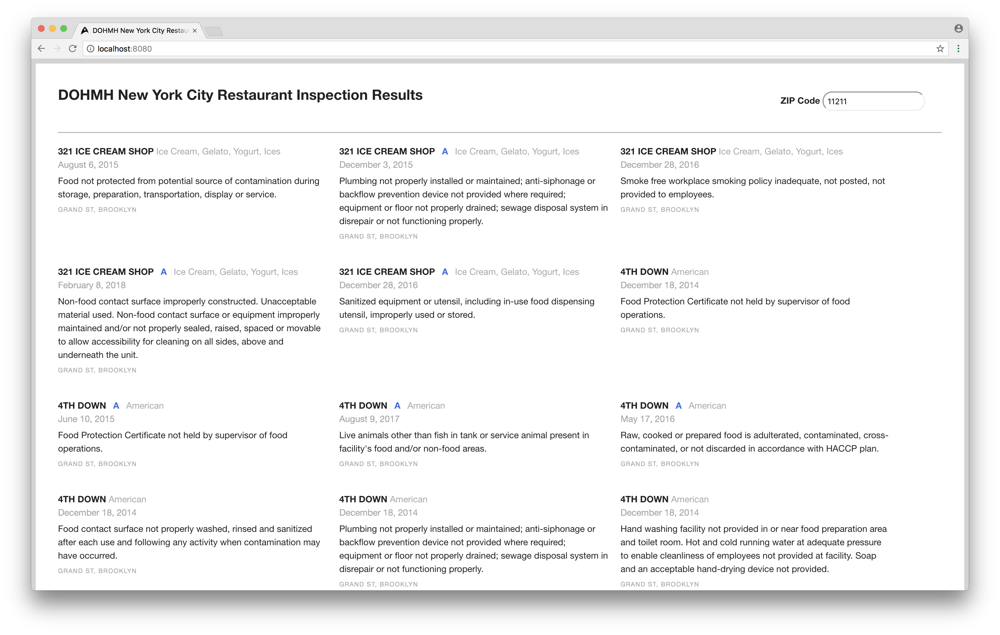

# DOHMH-New-York-City-Restaurant-Inspection-Results

Using NYC OpenData, you can search by ZIP Code to see which restaurants were charged with health violations.

## Getting started

This app has only two dependencies (`moment` and `http-server`), `http-server` is only needed for development and is extremely easy to use.

Single line command to get started:

```sh
yarn install && http-server
```

Example terminal output:

```sh
$ yarn install && http-server

yarn install v1.3.2
[1/4] 🔍  Resolving packages...
success Already up-to-date.
✨  Done in 0.09s.
Starting up http-server, serving ./
Available on:
  http://127.0.0.1:8080
  http://192.168.1.102:8080
Hit CTRL-C to stop the server
```

Then visit [http://localhost:8080](http://localhost:8080) in your browser.

Here is what the search results look like:



## Reference
[NYC OpenData](https://data.cityofnewyork.us/Health/DOHMH-New-York-City-Restaurant-Inspection-Results/rs6k-p7g6) ([Spreadsheet](https://data.cityofnewyork.us/Health/DOHMH-New-York-City-Restaurant-Inspection-Results/xx67-kt59))
[SCORATA](https://dev.socrata.com/foundry/data.cityofnewyork.us/9w7m-hzhe)
[Letter grading for restaurants](https://www1.nyc.gov/site/doh/business/food-operators/letter-grading-for-restaurants.page)

